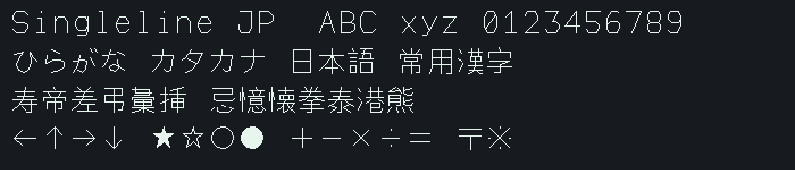

# Singleline JP Font

**V2 配布準備版: 2.0.0-rc.1。正式リリースではありません。** 独自中心線から作った静的TTF 8書体、可変TTF 2書体、16/18/24/32px × 8書体の1bitビットマップ32組を扱います。従来の2,584文字・18/24px資産は維持します。拡張漢字は機械合成を含む未校正の試作字形で、収録率やテスト成功は日本語字体の正確性・可読性の認定ではありません。

**TTFをアプリで使うだけならPythonは不要です。** ZIPを展開して `.ttf` をOSへインストールします。まず [インストール・更新・削除](docs/INSTALL.md) を参照してください。

- [用途別の4分割ZIP・検証とバージョン対応](docs/DISTRIBUTION.md): static / variable / bitmap / source。各ZIPは独立して使えます
- [変更履歴](docs/CHANGELOG.md) · [再現性・macOS差分への対処](docs/REPRODUCIBILITY.md) · [出典・ライセンス対応表](NOTICE.md)
- [優先字形の実測: 己已巳・未末・土士・高髙・吉𠮷](docs/PRIORITY-GLYPH-QA.md): 一部の16/18pxビットマップに同形が残ります
- [ファミリー設計・生成・検証](docs/FAMILY.md): 正確な収録数と欠字は `build/family/coverage.json` を参照

配布版 `2.0.0-rc.1` とフォント内部の版番号は別です。新ファミリーは `Singleline JP Lab …` / `Version 0.201`、従来TTFは `Singleline JP …` / `Version 1.000` のままです。V2という名前を理由に既存フォントを上書きしたり版番号を一括変更したりしません。OSの導入・アプリ別表示試験は、機械検査とは別の未完了項目です。

[新8書体TTF](build/family/static/) · [可変TTF](build/family/variable/) · [16/18/24/32pxの1bit資産](build/family/bitmaps/) · [全書体の再検査](docs/STYLE-RASTER-QA.md)

[編集用の完全な中心線SVGZ](build/family/centerlines.svgz)はgzip圧縮です。[展開手順](docs/FAMILY.md#editable-centerline-svg)で元のSVGを復元できます。生成時とソースZIPには生SVGも含みます。

## 従来版（既存資産）

小さな画面向けの独自単線ビットマップ文字セット。18px / 24px、計2,584文字。常用漢字2,136字、ひらがな・カタカナ、ASCII、全角英数字、記号を収録します。★●▲▼■は塗りつぶしです。

[全収録文字](assets/fonts/CHARACTERS.md) · [検索可能なカタログ](assets/fonts/catalog.html) · [出典とライセンス](NOTICE.md)
カタログはダウンロードしてブラウザで開いてください。[インストール用TTF](fonts/)も同梱します。複雑な字の18px表示や実機LEDの可読性は保証しません。

## 従来PNG/JSONをすぐ使う

PNG/JSONだけで利用可能です。`assets/fonts/custom-jp-24.*` と `custom-ascii-24.*` を組で使います。JSONの `glyphs` は文字をキーとし、`x/y/width/height` がPNG内の矩形、`advance` が送り幅です。白が点灯、黒が背景です。18px版も同じ形式です。

```sh
git clone https://github.com/eightman999/singleline-jp-font.git
cd singleline-jp-font
python3 -m venv .venv
.venv/bin/pip install -r requirements.txt
.venv/bin/python render.py '日本語 ABC 123 ％ ★' --scale 4 -o output.png
```

```python
from dot_font import DotFont
font = DotFont()
print(font.missing('寿帝差弔彙挿'))  # 未収録文字の一覧
pixels = font.mask('日本語 ABC')   # NumPy bool配列
```

実行時はNumPyとPillowのみ。OpenCVや字形ソースの読み込みは不要です。改行は行ごとに処理してください。欠字は自動置換せず例外になります。

## 再生成

```sh
.venv/bin/pip install -r requirements-build.txt
.venv/bin/python build_custom_ascii.py
.venv/bin/python build_custom_japanese.py
.venv/bin/python build_font_catalog.py
.venv/bin/python verify.py
```

線分は24単位の座標から1px幅・アンチエイリアスなしで生成します。`glyphs/kanji.py`・`hiragana.py`・`katakana.py`・`ascii.py`が字種別の正本、`symbols.py`が記号です。同一の線分は`paths.py`で共有します。旧部品合成器と重複した字形・後勝ちの修正定義を除去し、確定済みの全座標とPNGを維持しています。`custom_*_strokes.py`は既存利用者向けの薄い入口です。生成物のJSONに出典とハッシュを記録します。

コード・独自線分は元プロジェクトのAGPL v3、外部構成データと日本語生成物の扱いは[NOTICE.md](NOTICE.md)を参照してください。ゲーム、通信、Pi制御、旧フォント資産は含みません。

## 従来版のインストール用 TrueType

| 版 | 18px設計 | 24px設計 | 収録 |
|---|---|---|---|
| ASCII | [TTF](fonts/SinglelineJPASCII18-Regular.ttf) | [TTF](fonts/SinglelineJPASCII24-Regular.ttf) | ASCII 95字＋° |
| 全字 | [TTF](fonts/SinglelineJPFull18-Regular.ttf) | [TTF](fonts/SinglelineJPFull24-Regular.ttf) | 2,584字 |

ダウンロードしたTTFをOSのフォント管理機能でインストールできます。フォント名は `Singleline JP Full 24` などです。いずれもRegular。既存の点灯画素を閉じた輪郭にしたピクセル形状のフォントで、筆記用の単線パスや滑らかなアウトラインへの変換ではありません。設計サイズの整数倍を推奨します。ASCII版に日本語は含まれません。

```sh
.venv/bin/python build_ttf.py
.venv/bin/python verify_ttf.py
```

全字のcmap、送り幅、FreeTypeによる設計サイズでの表示とPNGとの一致を検証します。OSへのインストールや個別アプリの表示は別途確認してください。新旧構成の移行でも全字の座標と4枚のPNGが完全一致することを検証済みです。

TTF生成は[fontTools FontBuilder](https://github.com/fonttools/fonttools/blob/main/Lib/fontTools/fontBuilder.py)を使用します。TTFにも既存の出典・ライセンス条件を引き継ぎます。


